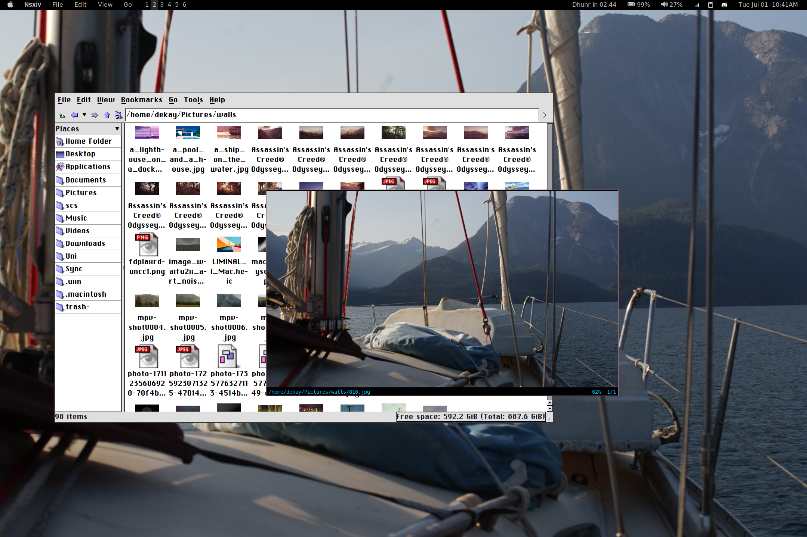
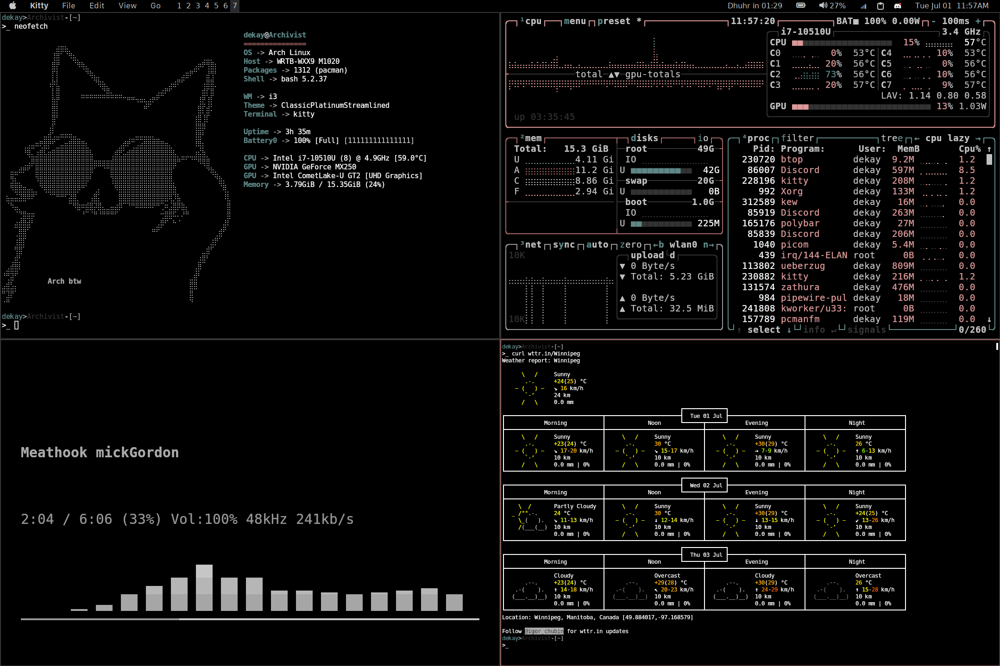
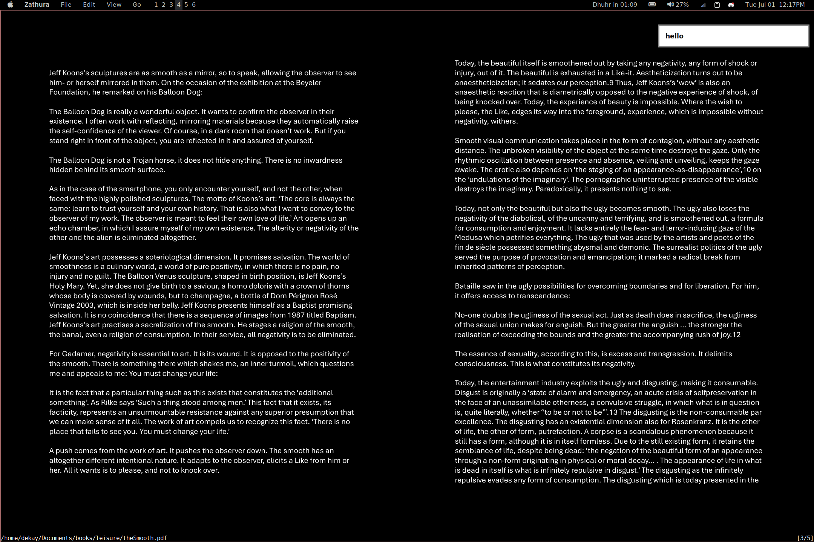
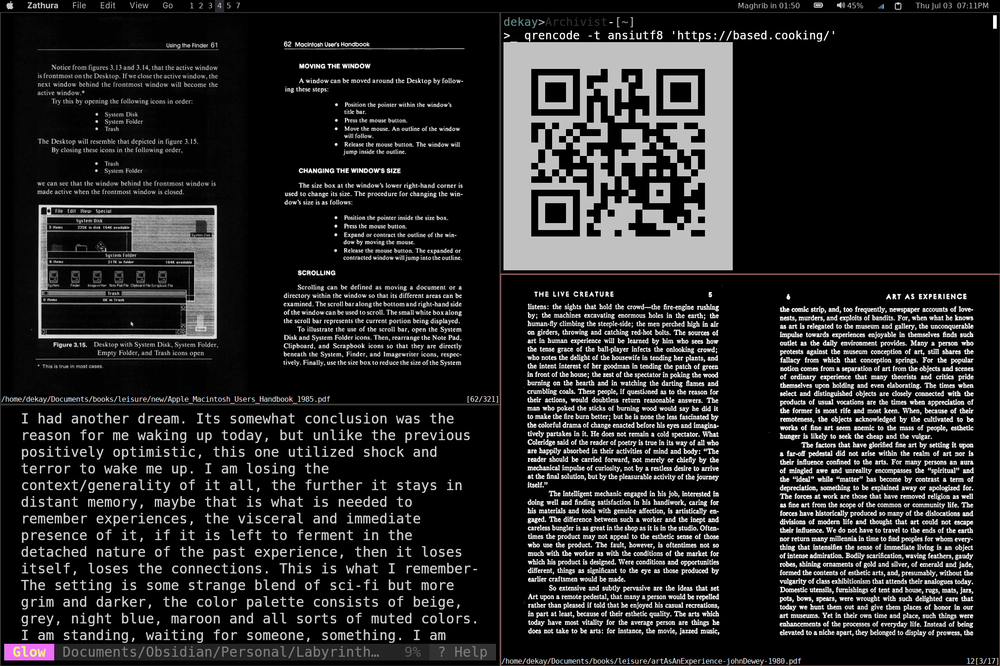
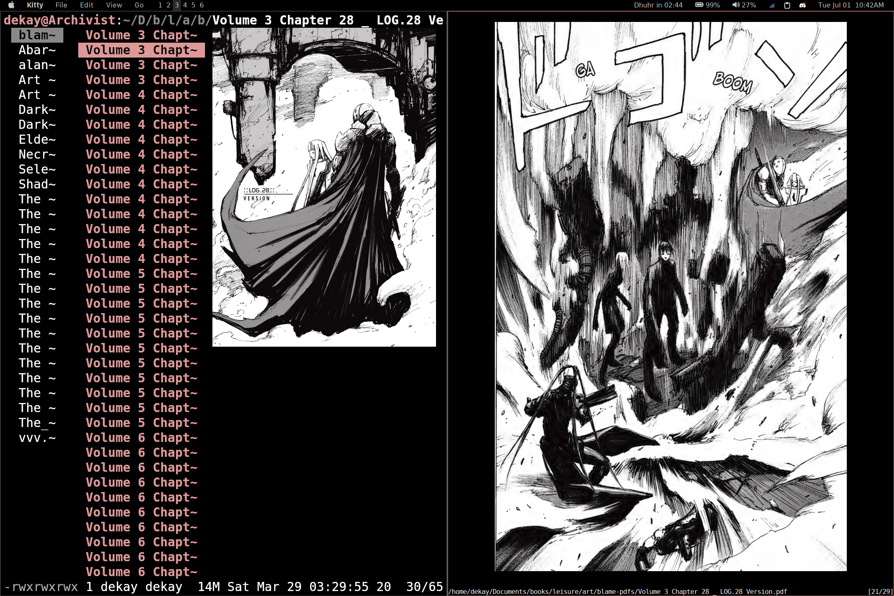

# The vertex of rices-

This setup mimics macOs as close as possible while keeping the functionality and minimal nature of i3wm.
While I like the aesthetic of the apple design, I prefer the versatility and freedom that comes with linux.

- My scripts are located in ```~/.config/scripts/```
- The configs are for-
    - i3 *(window manager)*
    - kitty *(terminal emulator)*
    - polybar *(status bar)*
    - lf *(terminal file manager)*
        - lf's ability to display images in the terminal is from Luke Smith's voidrice- ```https://github.com/LukeSmithxyz/voidrice``` 
    - dunst *(notification daemon)*
    - rofi *(software launcher)*
    - zathura *(pdf viewer)*
- You can use my dotfiles in any setup which is not tty.

 
## Usage

These dotfiles are intended to be used alongside numerous other programs and I hope you might be able to integrate them into your own workflows. 

Some additional programs I would recommend-

- nvim *(text/code editor)*
	- It does so much more than edit text
- nsxiv *(image/gif viewer)*
- mpv *(video player)*
- obsidian *(markdown editor)*
	- It does so much more than edit in markdown
- pet *(terminal command snippet manager)*

(Do send me pics of your setups and let me know if you encounter any problems or questions :] )


## Installation

```mkdir ~/dekay && cd ~/dekay```

```git clone https://github.com/userdekay/dotfiles.git``` 


:wq







